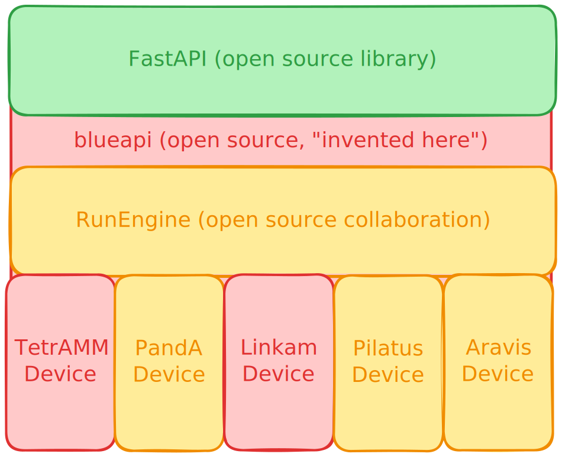
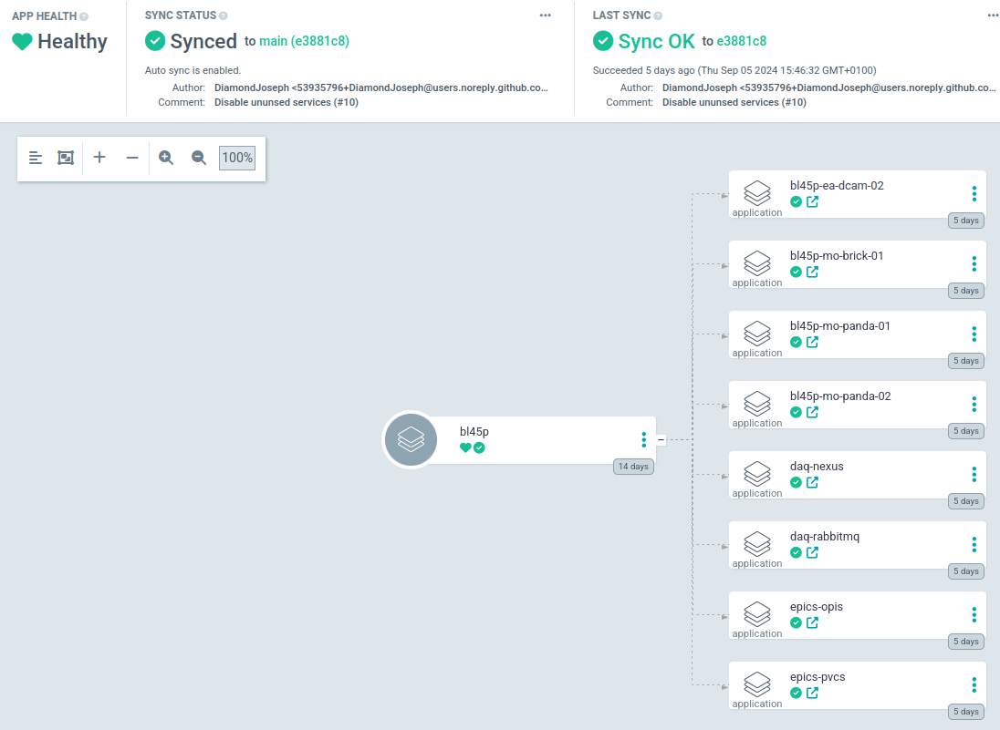
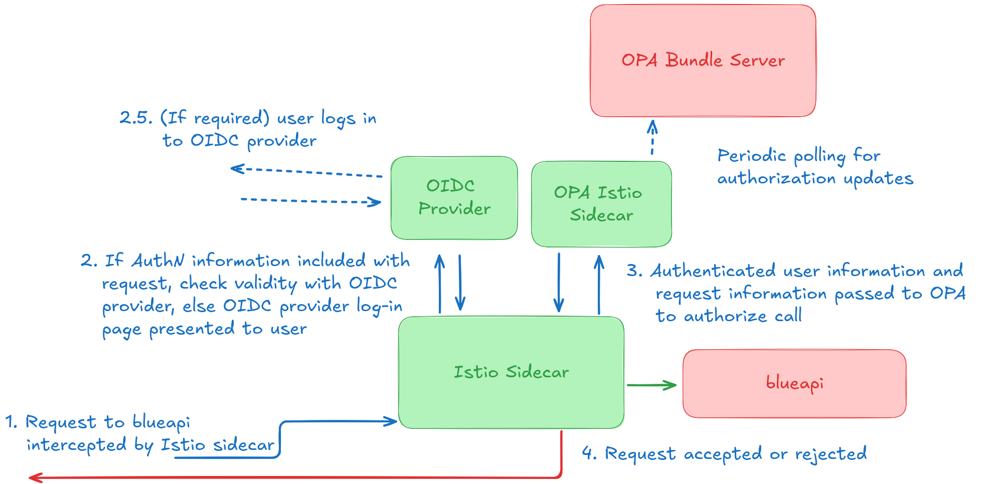
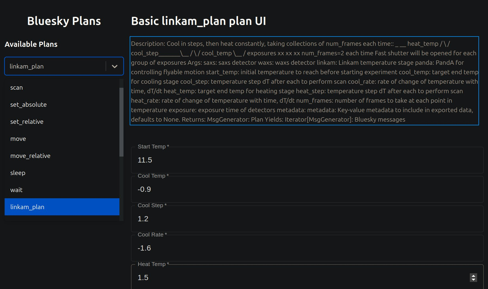

# Not-invented-here: Building an acquisition platform with off-the-shelf components

## Introduction

Diamond Light Source has deprecated the GDA (Generic Data Acquisition) platform and is replacing it with Athena, a service-based acquisition platform centred on the bluesky data collection framework from NSLS-II. Historically Diamond has struggled to overcome a mindset that every aspect of the operation of a Synchrotron is equally and inextricably unique. This poster seeks to dispel that myth and describes experiments that have occured and are ongoing which make use of pre-existing free open-source software, with effort spent on altering Diamond requirements or contributing to the existing: rather than "reinventing the wheel".

GDA is a previously open-source Java monolithic server/client appplication. The source was closed after changes in the build system required the Diamond filesystem was available to build and run the product and the available source was frozen at this point. Visiting users were able to contribute code written in Jython (Python implemented in the Java Virtual Machine) and only as specific alterations to existing experimental proceedures.

Athena is a service-based acquisition platform which is aiming to resolve several identified shortcomings of the GDA platform: lack of authentication & remote access; allowing user modification of scan proceedures; Jython being limited to Python 2.7; improving maintainability of a mature and expansive codebase.

## Time Series Experiment

In November 2023, an initial experiment was performed with a minimal Athena stack:

* GDA's Jython console was used as a client for blueapi, which ran in a beamline-local Kubernetes cluster.
* A PandA device, Pilatus detector, TetrAMM ammeter, Aravis camera and Linkam temperature controller were created in ophyd-async.
* A bluesky plan was written for the experimental proceedure which created and write a Sequence Table to the PandA; configured the Linkam to perform a stepped scan down in temperature, then target a high temperature; enabling the PandA to periodically triggered the other devices to collect while the Linkam went to the high temperature.
* The bluesky RunEngine controlled the experiment and emitted bluesky event-model documents which were consumed by a NeXus service written to convert from the event-model scheme to Diamond's expected NeXus structure.

### ophyd-async

Diamond's I22 beamline previously utilised a Time Frame Generator for time series experiments, however the device was end of life and at risk of failing. GDA had good support for hardware triggered experiments using the PyMalcolm[1] middleware layer but did not neatly support variable period scanning.
Diamond brought expertise in the field of hardware-triggered scanning to the bluesky collaboration in the form of ophyd-async[2], which revisited some assumptions made in the original ophyd library[3], the oldest of the libraries in the organisation. Ophyd amounts to ~22,000 non-test lines of code: ophyd-async currently consists of ~7,000, while meeting most existing use cases, and unlocked the use of the core bluesky library[4] (~19,000 LOC).

[1]<https://github.com/DiamondLightSource/pymalcolm>
[2]<https://github.com/bluesky/ophyd-async/>
[3]<https://github.com/bluesky/ophyd>
[4]<https://github.com/bluesky/bluesky>

### blueapi

GDA historically operated as a server/client model, with the client running either as a user or a beamline account while the server ran as a privileged user able to write to the shared filesystem. This contrasts with the usual mode at NSLS-II of running bluesky directly from the command line, with data presented by a data API. To allow a continuation of service  blueapi: which combines a bluesky RunEngine; a REST API; and necessary context mapping between them was produced.

Blueapi's REST API is served by the FastAPI library for python: together with the Pydantic data validation library to construct JSON schemas for experimental proceedures, this enables the service to be wholly written in modern Python. Blueapi is currently <3000 non-test lines of code: excluding test code, the Yaml templates for its helm deployment are on near-parity, but provides a crucial connection between the served API and running experimental proceedures.

*Blueapi is the glue between FastAPI and the RunEngine. Some device classes were written for the experiment, but others were contributed generic devices.*

### NeXus & Analysis

### Deployment & Maintenance

The Athena stack was deployed with Helm on a Kubernetes cluster local to the beamline by utilising a Helm Umbrella chart with components as dependencies: blueapi, the NeXus service and a RabbitMQ instance[1]. This enabled us to deploy the stack as a coherent block of functionality.

Moving GDA messaging into Kubernetes was an existing desire to address observed reliability problems by making use of monitoring and service restarting, however no up-to-date supported ActiveMQ Helm deployment could be found. As GDA internal messaging was utilising JMS, RabbitMQ was deployed with a JMS plugin and changes to the GDA core libraries to enable switching between ActiveMQ and RabbitMQ were made.

[1]<https://artifacthub.io/packages/helm/bitnami/rabbitmq>

## Stopflow Experiment & towards Athena 1.0

A 2nd experiment, initially due to occur June 2024 but delayed due to hardware problems to March 2025 will again make use again of time-based PandA hardware scanning.

* FastAPI autogenerated API page used as client to run the experiment from a web browser, enabling browser-based OIDC flow.
* Previous devices updated to ophyd-async 0.5 patterns, devices created for background beamline readings (mirror positions, synchrotron current etc.)
* A bluesky plan was written for the experimental proceedure:
  * Capturing background devices at start and end of scan
  * Creating and writing a Sequence Table to the PandA to capture N frames, then await a hardware trigger and collect M additional frames
* A NeXus device metadata service created and utilised by the existing NeXus service to get invariant data about devices involved in the scan (e.g. pixel size of the Pilatus detectors).

### Tracing and Metrics

GDA, as a monolithic application, was simple to track operations and debug locally. Transitioning to a service based architecture loses simplicity of debugging. Tracing calls through the system, in addition to logging within the services, enables introspection of the whole system for debugging and enables collection of metrics. Tracing is being implemented with Open Telemetry[1], Jaeger[2] and Prometheus[3]

Below an example experiment is traced through blueapi, RabbitMQ and the legacy NeXus service, plotted with Jaeger: blueapi takes ~1ms to publish new data, and is expected to do so at ~10Hz. In this example, the NeXus service takes just over 100ms to consume per-point data and write it to disk, suggesting that it may eventually become a bottle neck.

This example gives some easy places to look for efficiency gains: deserialising the StartDocument took much longer than similar operations, it may benefit from an additional pass. If in a larger dataset it was a standout, or if the length of the deserialising obviously changed after a new version was released, it may also warrant investigation. Gathering the data allows us to make reasoned decisions.

*An example OTEL trace viewed in Jaeger*

[1]<https://opentelemetry.io/>
[2]<https://www.jaegertracing.io/>
[3]<https://prometheus.io/>

### ArgoCD

The Helm umbrella chart makes assumptions about interoperability requirements of the services, and makes atomic changes and maintenance more awkward than intended. Initial moves in the direction of deploying services with ArgoCD are underway, with aims of having beamline state represented by 2 repositories: one containing the state of what is deployed[1], and another representing the state of the deployed software[2].

ArgoCD[3] is a Kubernetes operator which operates similarly to Helm but allows for a combination of deploying multiple services (similarly to the prior Helm Umbrella chart) while also rolling updates individually to those services, by deploying as an app-of-apps:[4] in the linked examples, p45-deployment[1] defines the app while p45-services[2] defines the apps.

[1]example: <https://github.com/epics-containers/p45-deployment>
[2]example: <https://github.com/epics-containers/p45-services>
[3]<https://argo-cd.readthedocs.io/en/stable/>
[4]<https://argo-cd.readthedocs.io/en/stable/operator-manual/cluster-bootstrapping/#app-of-apps-pattern>

### AuthN/AuthZ

Authentication (knowing which user made a request) and Authorization (deciding whether the user is allowed to make a request) becomes even more important as data collection is no longer limited to on-site.

Athena has been developed with auth concerns from its conception, however infrastructure has been delayed. AuthN is anticipated to be in place by the end of the year, with the user logging in to blueapi through an OIDC flow[1], either as a command line tool or through a web front end, with authorization provided by Open Policy Agent (OPA)[2] or a similar authorization provider.

A pair of example flows which are being considered are shown:

The first makes use of FastAPI middlewares[3] to authenticate the user against an external OIDC provider (existing authentication infrastructure) and authorize the call for the authenticated user. In this arrangement, the size and complexity of blueapi is slightly increased and all requests are processed inside the service.

*Auth/Auth enabled by use of middleware bundled into blueapi*

The second makes use of Sidecars[4]: a service mesh (e.g. Istio[5]) deploys all pods with additional containers that can intercept incoming traffic and pre-process it, including redirecting undirected traffic to the OIDC provider, or authorizing the call with an external authorization provider, such as an instance of OPA.

*Auth/Auth enabled by use of a ServiceMesh in the Kubernetes cluster*

The decision of which architecture will be adopted is a pending question: if multiple services require to authenticate, the service mesh is repeatable and language agnostic; however it adds initial complexity and configuration, and is confined not just to deployment with Kubernetes, but mandates particular configuration.

[1]<https://openid.net/developers/how-connect-works/>
[2]<https://www.openpolicyagent.org/>
[3]<https://fastapi.tiangolo.com/tutorial/middleware/>
[4]<https://kubernetes.io/docs/concepts/workloads/pods/sidecar-containers/>
[5]<https://istio.io/latest/about/service-mesh/>

## Next steps

### Client Generation

We are currently exploring how to offer generated GUIs for plans exposed by blueapi to contribute resources to the bluesky-webclient library[1]. The below example extracts the docstring from a python plan[2] and provides appropriate fields for the type using JSONForms[3] and Pydantic[4] data validation.
While beamlines that operate a standard experimental proceedure may wish to specialise their UI components, blueapi will provide at minimum a viable generic UI and is increasingly aiming to enable rich UI generation[5][6][7] by making use of Python annotations and Pydantic Field objects[8] which are all optional inclusions.

*Autogenerated UI using JSONForms for the plan run in November 2023*

[1]<https://github.com/bluesky/bluesky-webclient>
[2]<https://github.com/DiamondLightSource/i22-bluesky/blob/1f0a00828b006388d1a56b0f426610ab8d7bfcdf/src/i22_bluesky/plans/linkam.py#L50>
[3]<https://jsonforms.io/>
[4]<https://docs.pydantic.dev/>
[5]<https://github.com/DiamondLightSource/blueapi/issues/518>
[6]<https://github.com/DiamondLightSource/blueapi/issues/519>
[7]<https://github.com/DiamondLightSource/blueapi/issues/616>
[8]example: <https://github.com/DiamondLightSource/i22-bluesky/pull/90/files>

### Widening Adoption

Ophyd-async will soon support N-dimensional trajectory scans through use of the ScanSpec library[1]: once this is in place, it is hoped that many of the experimental proceedures currently in use at Diamond can be replicated. A widening library of ophyd-async device and behaviour support in both the library itself and in dodal[2], the Diamond device library, alongside beamline-specific code[3] and technique-specific code[4] is expected to be responsible for new projects at Diamond and an increasing proportion of business-as-usual.

[1]<https://github.com/bluesky/scanspec>
[2]<https://github.com/DiamondLightSource/dodal>
[3]example: <https://github.com/DiamondLightSource/i22-bluesky>
[4]example: <https://github.com/DiamondLightSource/mx-bluesky/>

### Data API & h5py-based NeXus

Existing Diamond data analysis pipelines rely on NeXus SWMR (single write, multiple read) to perform analysis of data as it is written to the NeXus file. For Diamond-II flagship beamlines coming online in the next few years analysis will instead be either from a data API (likely bluesky/tiled[1]) or by consuming the bluesky event-model documents directly. This decouples the NeXus file from needing to be written "live" during the experiment, and provides an opportunity to rethinking priorities of writing the file: if the file is written as a post-processing step, then results of processing can be included to make consuming the data simpler, and archiving the file more efficient.

It is intended that the legacy NeXus service will be retired after event-model document storage is finalised.

[1]<https://blueskyproject.io/tiled/index.html>
